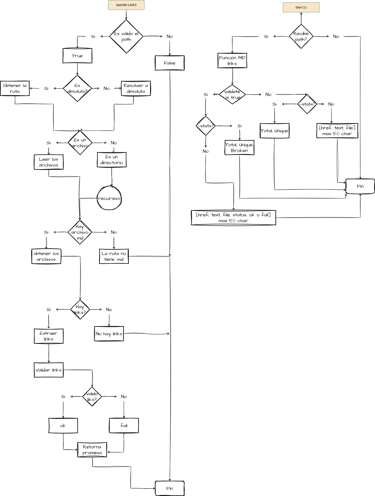

# MD-Links

Esta libreria es una herramienta que usa Node.js, para leer y analizar archivos en formato Markdown, y asi verificar los links que contengan y reportar algunas estadísticas.

## Descripción 

La libreria md-links necesita ingresar una ruta absoluta o relativa de un archivo o directorio para extraer las url y el texto de los links encontrados en los archivos '.md'.
  Utilizar el comando '--validate' o '-v' para saber su estatus http.
  Utilizar el comando '--stats' o '-s' para contabilizar la cantidad total de links y links unicos encontrados en los archivos.
  Utilizar la mezcla de ambos comandos para contabilizar cuántos links 'rotos' existen.

## Instalación

Para instalar y utilizar MD-Links, sigue estos pasos:

1. Asegúrate de tener [Node.js](https://nodejs.org) instalado en tu computadora.
2. Abre una terminal y navega hasta el directorio de tu proyecto.
3. Ejecuta el siguiente comando para instalar el módulo:

```bash
npm install md-links-jhosefin

## 9. Checklist

### General

* [x] Puede instalarse via `npm install --global <github-user>/md-links`

### `README.md`

* [x] Un board con el backlog para la implementación de la librería.
* [x] Documentación técnica de la librería.
* [x] Guía de uso e instalación de la librería

### API `mdLinks(path, opts)`

* [x] El módulo exporta una función con la interfaz (API) esperada.
* [x] Implementa soporte para archivo individual
* [x] Implementa soporte para directorios
* [x] Implementa `options.validate`

### CLI

* [x] Expone ejecutable `md-links` en el path (configurado en `package.json`)
* [x] Se ejecuta sin errores / output esperado
* [x] Implementa `--validate`
* [x] Implementa `--stats`

### Pruebas / tests

* [x] Pruebas unitarias cubren un mínimo del 70% de statements, functions,
  lines, y branches.
* [x] Pasa tests (y linters) (`npm test`).
